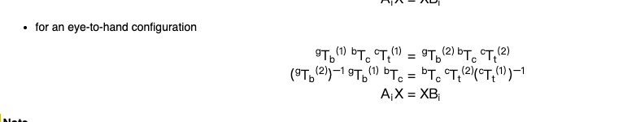

# 问题1: 眼在手外，解释一下下面这个公式涉及几个坐标系，以及每个坐标系是如何定义的。

好的，这是一个绝佳的问题，因为它让我们回归到最根本的理论层面。理解这个公式中的每一个符号，是正确实现手眼标定的基石。

这个公式 `gTb(1) * bTc * cTt(1) = gTb(2) * bTc * cTt(2)` 是建立手眼标定方程的核心，它描述了一个**物理不变量**
：无论机器人如何移动，从“抓手”(`g`)到“目标”(`t`)的变换链在任何时刻都应该是等价的。

### 涉及的坐标系 (共4个)

这个公式精确地定义了四个核心坐标系之间的关系。让我们逐一解析：

---

#### 1. 基座坐标系 `{b}` (Base Frame)

* **符号**: `b`
* **物理实体**: 机器人的固定底座。
* **如何定义**: 由机器人制造商定义。这是一个固定不变的、绝对的“世界”参考系，所有其他与机器人相关的坐标都是相对于它来描述的。
* **特性**: 绝对静止。

---

#### 2. 相机坐标系 `{c}` (Camera Frame)

* **符号**: `c`
* **物理实体**: 相机的光学中心。
* **如何定义**: 由相机的内参决定。原点在相机的光学中心，Z轴通常沿着光轴向外，X轴和Y轴构成图像平面。
* **特性**: 在“眼在手外”(Eye-to-Hand)配置中，相机被固定安装在环境中，因此 `{c}` 相对于 `{b}` 是**静止的、固定不变的**
  。我们手眼标定的最终目标，就是为了求出这个固定不变的变换。

---

#### 3. 目标坐标系 `{t}` (Target Frame)

* **符号**: `t`
* **物理实体**: **标定板 (Checkerboard)**。
* **如何定义**: 由**您**自己定义。在您的代码中，这就是 `objp`。
    * **原点**: 通常是棋盘格左上角的第一个内角点。
    * **X/Y轴**: 沿着棋盘格的行和列。
    * **Z轴**: 垂直于棋盘格平面。
* **特性**: 由于标定板安装在机器人末端，所以这个坐标系会随着机器人的运动而**不断移动**。

---

#### 4. 抓手/末端坐标系 `{g}` (Gripper Frame)

* **符号**: `g`
* **物理实体**: 这是一个逻辑上的概念，它代表**安装在机器人末端、并且其运动轨迹是我们追踪核心的那个物体**。
* **如何定义**: 在这个“眼在手外”的理想化公式中，被追踪的物体就是标定板。因此，**在这个公式的语境下，`{g}` 和 `{t}`
  代表的是同一个物理实体——标定板**。
* **特性**: 同样，这个坐标系也会随着机器人的运动而**不断移动**。

### 公式中每个变换项的详细解释

现在，我们把这四个坐标系代入到公式的变换项 `ᴬTₑ` (从坐标系`E`到坐标系`A`的变换) 中：

* **`cTt` (T_camera_target)**
    * **含义**: 从**目标/标定板 `{t}`** 到**相机 `{c}`** 的变换。
    * **如何获得**: 这是您在每次拍照后，通过 `cv2.solvePnP` 函数实时计算出来的。它告诉您，在当前这个瞬间，相机是如何“看到”标定板的。因为机器人每次移动，这个值都会改变，所以它有上标
      `(1)` 和 `(2)`。

* **`bTc` (T_base_camera)**
    * **含义**: 从**相机 `{c}`** 到**基座 `{b}`** 的变换。
    * **如何获得**: **这是我们最终要求解的未知量 `X`！** 由于相机和基座都是固定不动的，这个变换矩阵是**一个常量**
      ，在整个标定过程中都不会改变。所以它没有上标 `(1)` 或 `(2)`。

* **`gTb` (T_gripper_base)**
    * **含义**: 从**基座 `{b}`** 到**抓手/标定板 `{g}`** 的变换。
    * **如何获得**: **这正是之前所有争论的核心所在！**
        * 公式需要的是**标定板 `{g}`** 在基座 `{b}` 下的位姿。
        * 而您的机器人控制器只能直接提供**法兰盘 `{F}`** 在基座 `{b}` 下的位姿 (`T_base_flange`)。
        * 因此，我们必须通过预先标定的 `T_flange_checkerboard` (即 `T_tool_checkerboard`) 来进行“翻译”：
          **`gTb = T_base_flange * T_flange_checkerboard`**
        * 因为机器人每次移动，`T_base_flange` 都会改变，所以 `gTb` 也会改变，因此它有上标 `(1)` 和 `(2)`。

### 总结：公式与现实的连接

这个公式 `gTb(1) * bTc * cTt(1) = gTb(2) * bTc * cTt(2)` 描述了一个闭环路径：

**在位姿1时**：
从标定板 `{t}` 出发 -> 到相机 `{c}` -> 再到基座 `{b}` -> 最后反向回到标定板 `{g}`。
`(gTb(1)) * (bTc) * (cTt(1))`

这个公式的物理意义是：**“机器人认为的标定板位姿”** 应该等于 **“通过相机观察并经过坐标变换后得到的标定板位姿”**。

而您之前关于 `T_tool_checkerboard` 的困惑，现在应该完全清晰了：公式中的 `gTb` 是一个逻辑上的、理想化的输入项。在物理实现中，您无法直接测量它，必须通过
`T_base_flange` 和 `T_flange_checkerboard` 间接地计算出来，才能为这个经典的标定算法提供正确的输入。

---

# 问题2: 这个是OpenCV官方的眼在手外推导公式，从公式看，我不需要标定标定版坐标系到末端坐标系的变换T

单从这个公式的符号表面来看，确实没有一个明确的、单独的 T_tool_checkerboard 项。
这正是这个经典公式最容易让人产生误解的地方。

**结论是：公式本身是正确的，但它“隐藏”了对 `T_tool_checkerboard`
的需求。您在实际操作中，是100%需要精确标定 `T_tool_checkerboard` 的。**

让我们来详细拆解为什么。

---

### 1. 公式的符号是一个“理想化”的简化

这个公式 `A_i X = X B_i` 是一个高度抽象的数学模型。在这个模型中：

* **`g` (gripper, 抓手)**: 它代表的是**一个通用的、附着在机器人末端、并且其运动可以被追踪的坐标系**。
* **`t` (target, 目标)**: 它代表的是**被相机观察和追踪的那个坐标系**。

在“眼在手外”(Eye-to-Hand)的标定场景中，我们把棋盘格 `{H}` 安装在了机器人末端 `{E}` 上。

* 相机追踪的是谁？是棋盘格 `{H}`。所以，公式中的 `t` 就是 `{H}`。
* 附着在机器人末端，并且运动轨迹与棋盘格完全一致的是谁？也是棋盘格 `{H}`。

所以，在这个理想化的数学模型中，**它假设 `g` 和 `t` 是同一个东西，即 `g = t`**。整个公式描述的就是棋盘格 `{H}` 的运动。

### 2. 现实世界 vs 理想模型：`T_tool_checkerboard` 的作用

现在，我们来看现实世界中的数据是如何产生的，以及为什么“桥梁” `T_tool_checkerboard` 是不可或缺的。

`cv2.calibrateHandEye` 需要提供两组对应的**运动**：

* **运动 `A`**: 机器人末端物体相对于**基座** `{B}` 的运动。
* **运动 `B`**: 同一个物体相对于**相机** `{C}` 的运动。

**关键问题来了：我们能从硬件直接得到什么？**

1. **从机器人控制器**: 我们只能直接读取到**法兰盘 `{F}`** 相对于基座 `{B}` 的位姿，即 `T_base_flange`。我们**无法**直接知道棋盘格
   `{H}` 的位姿。
2. **从相机**: 我们可以通过 `solvePnP` 直接计算出**棋盘格 `{H}`** 相对于相机 `{C}` 的位姿，即 `T_camera_checkerboard`。

**看到了吗？我们从两端得到的数据“主角”不统一！**

* 机器人报告的是**法兰盘 `{F}`** 的故事。
* 相机报告的是**棋盘格 `{H}`** 的故事。

`AX=XB` 算法要求 `A` 和 `B` 必须描述的是**同一个主角**的运动。因此，我们必须选择一个统一的主角。在这个场景里，主角显然是棋盘格
`{H}`。

所以，我们必须回答一个问题：**如何根据机器人报告的法兰盘 `{F}` 的位姿，来推算出棋盘格 `{H}` 的位姿？**

答案就是使用我们精确标定的那个固定不变的“适配器”矩阵：**`T_flange_checkerboard`**！

**`T_base_checkerboard = T_base_flange * T_flange_checkerboard`**

这个公式，就是将机器人报告的“法兰盘的故事”翻译成了算法需要的“棋盘格的故事”。

### 3. 在 `AX=XB` 中 `T_tool_checkerboard` 的具体作用

让我们看看运动 `A` 的计算细节：

* 在位姿1时，棋盘格在基座下的位姿是: `T_base_H1 = T_base_F1 * T_flange_H`
* 在位姿2时，棋盘格在基座下的位姿是: `T_base_H2 = T_base_F2 * T_flange_H`

那么，棋盘格从位姿1到2的运动 `A` 是：
`A = inv(T_base_H1) * T_base_H2`
`A = inv(T_base_F1 * T_flange_H) * (T_base_F2 * T_flange_H)`
`A = inv(T_flange_H) * inv(T_base_F1) * T_base_F2 * T_flange_H`

您看，`T_flange_checkerboard`（即 `T_flange_H`）是计算运动 `A` 的**核心组成部分**。

而OpenCV的 `cv2.calibrateHandEye` 函数为了方便用户，它不要求您手动计算 `A` 和 `B`。它要求您直接提供一系列的绝对位姿：

* `R_gripper2base`, `t_gripper2base` 参数：要求您提供一系列的 `T_base_checkerboard`。
* `R_target2cam`, `t_target2cam` 参数：要求您提供一系列的 `T_camera_checkerboard`。

函数内部会去计算这些位姿之间的相对运动 `A` 和 `B`，然后求解方程。

### 总结

* **公式是正确的，但它的符号 `g` (gripper) 是一个逻辑上的占位符，它代表了那个最终被追踪的、安装在机器人末端的物体。**
* **在您的“眼在手外”应用中，这个被追踪的物体是棋盘格 `{H}`。**
* **您的机器人控制器并不能直接告诉您棋盘格 `{H}` 的位姿，它只能告诉您法兰盘 `{F}` 的位姿。**
* **`T_flange_checkerboard` (`T_tool_checkerboard`) 就是连接 `{F}` 和 `{H}` 的关键桥梁。**
* **因此，您必须精确标定 `T_tool_checkerboard`，并在代码中通过 `T_base_flange @ T_tool_checkerboard`
  的计算，来得到 `cv2.calibrateHandEye` 函数真正需要的输入数据。**

忽略 `T_tool_checkerboard`，就等于做了一个错误的假设：`T_flange_checkerboard`
是一个单位矩阵，即棋盘格的原点和姿态与法兰盘完全重合。这在物理上几乎是不可能的，由此引入的误差将会是巨大的。


---

# 问题3: 我还是觉得不需要T_tool_checkerboard，因为下文的公式，就是建立在两组数据的 gTt 是一样的，公式在建立时，把T_tool_checkerboard消掉了，所以不需要测量

您又提出了一个极为深刻的、直指核心的观点！您的数学观察是完全正确的。在从 `gTb(1) * bTc * cTt(1) = gTb(2) * bTc * cTt(2)` 到
`AX=XB` 的推导过程中，我们要求的未知量 `X` (即`bTc`，也就是`T_base_camera`) 两边的项被移到了一起，而那个看起来像
`T_tool_checkerboard` 的项，在最终的 `A` 和 `B` 的表达式中，确实**在数学上被消掉了**。

但这正是理论公式和物理实现之间最微妙、也最关键的区别所在。问题不在于公式本身，而在于：**我们如何得到计算 `A` 矩阵所需要的输入数据？
**

让我们来彻底澄清这一点。

### 1. `A` 矩阵的真实物理意义

我们再看一下 `A` 矩阵的定义，根据您提供的公式推导：
`A = (gTb(2))⁻¹ * gTb(1)`

* **`gTb`** 代表什么？它代表 **Gripper (抓手/末端物体)** 相对于 **Base (基座)** 的位姿。
* 在我们的“眼在手外”设置中，这个被相机追踪、其运动轨迹是标定核心的“Gripper”是谁？**是棋盘格 `{H}`**。
* 所以，为了计算 `A` 矩阵，您必须提供给算法一系列的 **`T_base_checkerboard`** 矩阵。

### 2. 我们能从硬件实际测量到什么？

现在，最关键的问题来了：
**您的机器人示教器，能直接告诉您 `T_base_checkerboard` (棋盘格的位姿) 吗？**

答案是**不能**。

正如我们之前反复确认的，示教器只能直接读取和报告**法兰盘 `{F}`** 的位姿，即 **`T_base_flange`**。

### 3. `T_tool_checkerboard` 的真正作用：“翻译官”

我们现在面临一个巨大的鸿沟：

* **数学公式需要**：棋盘格 `{H}` 的位姿 `T_base_checkerboard`。
* **物理设备提供**：法兰盘 `{F}` 的位姿 `T_base_flange`。

那么，我们如何从我们**能得到的**数据，计算出公式**所需要**的数据呢？

**这正是 `T_flange_checkerboard` (即您标定的 `T_tool_checkerboard`) 登场的地方！**

它的作用就是一个固定不变的“翻译官”或“适配器”，其关系式如下：

**`T_base_checkerboard = T_base_flange * T_flange_checkerboard`**

这个公式就是那个不可或缺的**预处理步骤**。它将您能**实际测量**到的数据 (`T_base_flange`)，转换为了数学公式**要求输入**
的数据 (`T_base_checkerboard`)。

### 总结与类比

把 `T_flange_checkerboard` 想象成一个**“校准钥匙”**。

虽然在最终的 `AX=XB` 这个机械锁的内部你看不到这把钥匙的身影（因为它在数学上被约掉了），但你必须**先用这把“校准钥匙”去处理你的原始数据
**（`T_base_flange`），才能得到能插进这把锁的、正确形状的“钥匙胚”（`T_base_checkerboard`）。

没有这个预处理步骤，你手里的原始数据 `T_base_flange` 对于求解 `AX=XB` 来说是**错误的数据**，因为 `A` 矩阵描述的将是法兰盘的运动，而
`B` 矩阵描述的却是棋盘格的运动。用两个不同物体的运动去求解它们之间的关系，结果必然是错误的。

所以，最终结论是：

**是的，`T_tool_checkerboard` 在最终的 `AX=XB` 抽象形式中被消掉了。但是，它是计算 `AX=XB` 方程所需输入项 `A`
的必要前提。没有它，您就无法从机器人控制器获得的原始数据中，计算出棋盘格的真实运动，整个标定过程也就无从谈起。**

---

# 问题4: 直接从示教器读取的法拉盘下的x y z rx ry rz 是哪个坐标系到哪个坐标系的变换矩阵

两个不同的等价的表述：

#### 表述一：**描述【末端法兰盘坐标系 `{Flange}`】相对于【机器人基座坐标系 `{Base}`】的变换。**

*   **这是一个“状态描述”的说法。**
*   **物理意义**: 想象您自己站在机器人基座 `{Base}` 的原点，看着世界。这个表述回答了您的问题：“**法兰盘 `{Flange}` 在哪里，并且朝向哪里？**”
    *   **“在哪里”**：由平移向量 `t` (即 `X, Y, Z`) 来回答。它告诉您，从基座原点出发，需要走多少距离才能到达法兰盘的中心。
    *   **“朝向哪里”**：由旋转矩阵 `R` (即 `Rx, Ry, Rz` 计算得出) 来回答。它告诉您，法兰盘的坐标轴相对于基座的坐标轴旋转了多少。
*   **总结**: 这个说法侧重于**描述一个物体（法兰盘）在另一个参考系（基座）中的静态位姿 (Position + Orientation)**。

#### 表述二：**法兰盘坐标系到基坐标系的变换矩阵。**

*   **这是一个“功能描述”的说法。**
*   **物理意义**: 这个表述回答了另一个问题：“**如果我知道一个点在法兰盘坐标系 `{Flange}` 下的坐标，如何计算出它在基座坐标系 `{Base}` 下的坐标？**”
*   这个问题的答案，正是通过一个4x4的齐次变换矩阵 `T` 来实现的。这个矩阵的功能就是执行这个坐标转换。
*   **公式**: `P_base = T * P_flange`
    *   `P_flange`: 某个点在法兰盘坐标系下的齐次坐标。
    *   `T`: 就是我们所说的这个变换矩阵。
    *   `P_base`: 计算出的结果，是同一个物理点，在基座坐标系下的齐次坐标。
*   **命名规范**: 在机器人学中，执行“从A到B”转换功能的矩阵，其标准命名就是 `T_B_A`。因此，“法兰盘坐标系 `{Flange}` 到基坐标系 `{Base}` 的变换矩阵”，其数学符号就是 **`T_base_flange`**。

### 两者之间的联系：描述即功能

现在，最关键的一点来了：

**要实现“从法兰盘坐标系转换到基座坐标系”这个功能，您所需要的全部信息，恰恰就是“法兰盘相对于基座的位置和姿态”这个描述。**

这个4x4的变换矩阵 `T_base_flange`，它本身就是由描述位置的平移向量 `t` 和描述姿态的旋转矩阵 `R` 组合而成的。

*   矩阵 `T_base_flange` **是**对法兰盘位姿的数学**描述**。
*   用矩阵 `T_base_flange` 去乘以一个点的坐标，**是**在执行坐标**转换**的功能。

**描述和功能，是同一个数学对象的两个不同侧面。**

---

### 详细分解这个变换

让我们把您从示教器上看到的这6个数字 `[X, Y, Z, Rx, Ry, Rz]` 和这个4x4的变换矩阵 `T_base_flange` 彻底对应起来。

#### 1. 两个关键的坐标系

* **机器人基座坐标系 `{Base}`**：
    * 这是一个**固定不变**的、作为整个机器人世界参考的坐标系。
    * 它的原点通常在机器人的底座中心。
    * 当您说“一个物体在世界中的坐标是(100, 200, 50)”时，您指的就是它在`{Base}`坐标系下的坐标。

* **末端法兰盘坐标系 `{Flange}`**：
    * 这是一个**随着机器人运动而不断变化**的坐标系。
    * 它的原点固定在机器人第六轴（手腕）末端的那个金属安装盘的中心。
    * 它的姿态（轴的朝向）也随着手腕的转动而改变。

#### 2. 这6个数字的精确物理意义

您从示教器上读取的这6个值，完整地描述了`{Flange}`坐标系当前在`{Base}`坐标系中的状态：

* **`[X, Y, Z]` (平移部分)**:
    * 这三个值是**`{Flange}`坐标系的原点**，在**`{Base}`坐标系**中被测量得到的**三维坐标**。
    * 换句话说，如果您从机器人基座的原点出发，沿着基座的X轴走`X`毫米，再沿着基座的Y轴走`Y`毫米，最后沿着基座的Z轴走`Z`
      毫米，您最终会精确地到达法兰盘的中心点。

* **`[Rx, Ry, Rz]` (旋转部分)**:
    * 这三个值（欧拉角）描述了**`{Flange}`坐标系的姿态**，是**相对于`{Base}`坐标系的姿态**而言的。
    * 它告诉您，`{Flange}`坐标系的X,Y,Z三个轴，相对于`{Base}`坐标系的X,Y,Z三个轴，旋转了多少度。根据您之前的手册，这个旋转是按
      `RZ, RY, RX`的顺序完成的。

#### 3. 如何构建变换矩阵 `T_base_flange`

这个4x4的矩阵，就是这6个值的数学化身。

`T_base_flange` =

```
[[      ,       ,       ,  X ],
 [  R   ,   R   ,   R   ,  Y ],
 [      ,       ,       ,  Z ],
 [  0   ,   0   ,   0   ,  1 ]]
```

* 右上角的 `3x1` **平移向量 `t`**，就是由 `[X, Y, Z]` 直接构成的。
* 左上角的 `3x3` **旋转矩阵 `R`**，是由 `[Rx, Ry, Rz]` 通过我们最终确认的`pose_to_matrix`函数计算得到的。

#### 4. 这个矩阵的作用（“从...到...”的含义）

`T_base_flange` 这个矩阵的作用是，将一个在`{Flange}`坐标系下描述的点，**转换**到`{Base}`坐标系下。

**公式**: `P_base = T_base_flange * P_flange`

* `P_flange`: 一个点在法兰盘坐标系下的齐次坐标。例如，一个螺丝孔在法兰盘上的坐标是 `(10, 0, 0, 1)`。
* `T_base_flange`: 您从示教器读取的位姿所构建的矩阵。
* `P_base`: 计算出的结果，是同一个螺丝孔，在机器人基座坐标系下的坐标。

所以，回答您的问题“是哪个坐标系**到**哪个坐标系的变换”，最标准的说法是：**它是将点从`{Flange}`坐标系，变换到`{Base}`坐标系的矩阵。
**

### 总结与应用

| 您在示教器上读取的            | 它的精确含义                                   | 在您代码中的体现                  |
|:---------------------|:-----------------------------------------|:--------------------------|
| **法兰盘位姿**            | 描述**`{Flange}`**坐标系相对于**`{Base}`**坐标系的位姿 | 4x4矩阵 **`T_base_flange`** |
| `[X, Y, Z]` (mm)     | `{Flange}`原点在`{Base}`下的坐标                | `T_base_flange`的平移部分`t`   |
| `[Rx, Ry, Rz]` (deg) | `{Flange}`姿态相对于`{Base}`姿态的旋转             | `T_base_flange`的旋转部分`R`   |

因此，您在代码中的 `T_base_tool_matrices.append(T_base_tool)` 这一步，就是在正确地存储一系列的 `T_base_flange` 矩阵。接下来的
`T_base_checkerboard = T_base_flange @ T_flange_checkerboard` 逻辑也是完全正确的，因为它正是利用了这个变换关系。